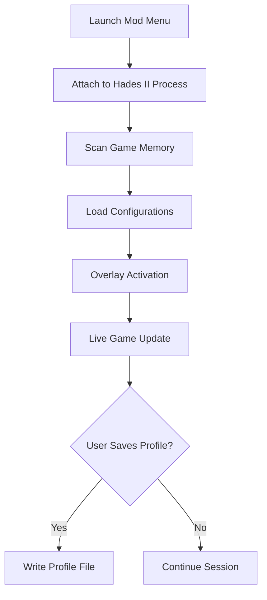

# Hades II Mod Menu 🔥

The **Hades II Mod Menu** is a premium customization system crafted for players who demand full control of their underworld journey. Designed for seamless integration and maximum performance, it allows live adjustments to gameplay variables, visual filters, and resource scaling — all through a sleek, in-game overlay.

This advanced tool transforms the Hades II experience into a creative sandbox for tuning difficulty, experimenting with builds, and exploring the game’s hidden potential without affecting core stability.

---

## ⚙️ Overview

Built with a **non-invasive injection framework**, the Mod Menu attaches to *Hades II* dynamically. This ensures 100% file integrity and zero permanent modifications. It provides intuitive menus for tuning god boons, adjusting run modifiers, or modifying world physics — everything updates instantly on-screen.

---

## ⚡ Features

| Category                 | Functionality                                                                |
| ------------------------ | ---------------------------------------------------------------------------- |
| **Gameplay Adjustments** | Modify god boon drop rates, currency gain, and cooldown timers.              |
| **Combat Enhancements**  | Enable rapid casting, invulnerability phases, or hitbox scaling.             |
| **Visual Effects**       | Toggle shaders, ambient fog, fire intensity, and cinematic filters.          |
| **Resource Editor**      | Instantly add Ambrosia, Obsidian, or Fate Threads with real-time feedback.   |
| **Performance Control**  | Lock FPS, toggle VSync, and optimize GPU load dynamically.                   |
| **Profile Manager**      | Save and switch between playstyles (e.g., “Speedrun”, “Godmode”, “Classic”). |

[!NOTE]
The Mod Menu is compatible with both Steam and Epic builds, automatically adjusting configuration offsets upon launch.

---

## 🧩 Compatibility

| Platform                  | Supported | Details                                   |
| ------------------------- | --------- | ----------------------------------------- |
| **Windows 10**            | ✅         | Full performance, ideal for DirectX 11    |
| **Windows 11**            | ✅         | Enhanced latency reduction                |
| **Steam Edition**         | ✅         | Auto-attach supported                     |
| **Epic Games Edition**    | ⚙️        | Manual attachment needed                  |
| **Controllers (Xbox/PS)** | ✅         | Full overlay control via D-Pad navigation |

[!IMPORTANT]
If your FPS limiter or adaptive sync is active, disable it in graphics settings before running the Mod Menu to prevent input delay on the overlay.

---

## 🧠 Setup Guide

**Step 1:** Download and extract the Hades II Mod Menu ZIP.
**Step 2:** Launch `Hades2_ModMenu.exe` as Administrator.
**Step 3:** Press **F9** to open the configuration overlay.
**Step 4:** Modify your preferred attributes in real time:

```ini
[Gameplay]
GodMode = true
AttackSpeed = 1.25
DashCount = 4
EnemyHealthScale = 0.8

[Visuals]
Bloom = Medium
Lighting = Dynamic
ShaderColor = #FF5522
```

**Step 5:** Save profiles with `Ctrl + S` — they auto-load next session.

---

## 🧩 Workflow Diagram



---

## 💬 FAQ

**Q1: Does it alter save files?**
🔹 No — all modifications are runtime-only and revert when the game closes.

**Q2: Can I use this offline?**
🔹 Absolutely. The Mod Menu runs 100% locally without network dependency.

**Q3: How often is it updated?**
🔹 New releases drop every major Hades II patch to ensure compatibility.

**Q4: Is controller input supported in the menu?**
🔹 Yes — navigate using D-Pad or analog sticks seamlessly.

**Q5: Can I disable visuals but keep stats active?**
🔹 Yes — toggle “Minimal Mode” for text-only overlay.

---

## 🧩 Advanced Settings

* Use **“Safe Mode”** for experimental physics or AI toggles — prevents instability.
* Set **Frame Cap = 0** to enable unlimited refresh syncing.
* The **Developer Console** within the menu allows custom scripting in Lua syntax:

```lua
if enemy.health < 0.3 then
    player.attackBoost = 1.5
end
```

[!WARNING]
Applying extreme values (e.g., AttackSpeed > 3.0) may cause animation desync or crash events.

---

## 🧭 Final Thoughts

The **Hades II Mod Menu** is the ultimate toolkit for creators, testers, and hardcore fans who crave control and experimentation. By merging advanced customization with stable performance, it brings limitless replay value to every run.
